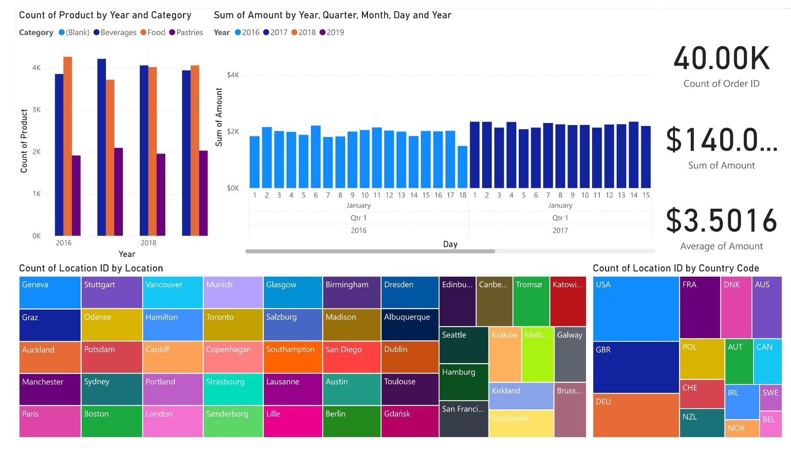

# Power BI Demo

This repository is a Power BI demonstration project illustrating core reporting, data modeling, and dashboard features using synthethic data.

## Features

- Interactive dashboards with multiple visual types
- Power Query data transformation steps
- DAX measures and calculated columns
- Guidance for publishing to Power BI Service

## Getting Started

1. Download and install [Power BI Desktop](https://powerbi.microsoft.com/desktop).
2. Clone this repository.
3. Open `PowerBI_Demo.pbix` in Power BI Desktop.
4. Preview different report tabs and explore datasets.

## File Structure

- `/data`: Datasets
- `/assets`: Images used in visuals
- `PowerBI_Demo.pbix`: Power BI report file

Power BI Beginner Activity: Guided Hands-On Homework
This activity will walk you through the core steps demonstrated in the ["Microsoft Power BI for Beginners – 2 Hour Power BI Crash Course!"](https://www.youtube.com/watch?v=sIxJCksa0K0&ab_channel=SimonSezIT) video by Simon Sez IT. You will learn to import data, prepare it for analysis, create a data model, build computations, and design interactive reports. Complete each step using the video for reference, but do not skip ahead to answers. Document your work and be prepared to share screenshots and short explanations.

This activity focuses on the first part of the video by SimonSezIT and extends the demo to show how to make visualizations with the data. All the visualizations presented in this solution are not part of the video.

## Instructions
You will: 

- Use Power BI Desktop (latest version recommended).
- Use the sample data provided with the video or similar datasets (CSV/Excel with sales, locations, products, etc.).
- Work through each section sequentially.
- Do not enter or copy any solution from the video—focus on understanding the process.
- Write down your steps, screenshots, and reflections for each activity section.

### 1. Introduction and Setup
Briefly describe what Power BI is and list some potential use cases.

Download and install Power BI Desktop.

Explore the main interface: identify and briefly describe the three primary views in Power BI Desktop.

### 2. Importing and Preparing Data
Import all CSV files from the folder containing the ```Sales Data``` into Power BI. Select Transform which will open Power Query Editor.

Merge the csv files using Power Query.

### ONLY GO THROUGH THE NEXT SECTION IF YOU DIDN'T MODIFY THE REGION TO THE UK LIKE IN THE VIDEO

Open the advanced editor and edit the line:
```
= Table.TransformColumnTypes(#"Expanded Table Column1",{{"Source.Name", type text}, {"Order ID", Int64.Type}, {"Date", type date}, {"Product", type text}, {"Country Code", type text}, {"Amount", type number}})
```
For the line:
```
= Table.TransformColumnTypes(#"Expanded Table Column1",{{"Source.Name", type text}, {"Order ID", Int64.Type}, {"Date", type text}, {"Product", type text}, {"Country Code", type text}, {"Amount", type number}})
```
This will change the query to read the date in text format.

Use the following DAX expression to parse the dates in the GB format "dd/MM/yyyy".
```
= Table.TransformColumns(#"Changed Type",{{"Date", each Date.FromText(_, "en-GB"), type date}})
```

Close the advanced editor.

### YOU MAY CONTINUE FROM HERE IF DIDN'T MODIFY REGION

Identify and remove unnecessary columns from the dataset.

Split the column Product containing compound data (e.g., product and city together) into two separate columns.
(Hint: Split column & Replace FUNCTIONS)

Change data type of column Amount to a Currency data type.

Save the current Query as *Sales_Prep*.

### 3. Building Lookup Tables and Preparing Relationships
Importing the ```countries.xlsx``` Excel file, rename the query as Country.

Importing the ```products.txt``` text file,  rename the query as Products.

Open Power Query by clicking on Transform Data.

Create a lookup table for Locations.

- Create a reference query from *Sales_Prep*
- Remove duplicates to ensure only unique values remain.
- Add a index column

Merge (join) the main sales or transactions table with the location lookup table to bring in unique IDs.

Remove any redundant columns resulting from this process.

Save the merged query as Sales.

### 4. Modeling Data and Relationships
Switch to Model view.

Link the Products field from Sales with the Products table.

### 5. Designing a Power BI Report
Create a report page.

Add at least three different types of visuals (e.g., card, bar chart, line chart, table, etc.).

Use formatting tools to improve the look of your visuals.

### 6. Solution

To use the ```PowerBI_Demo.pbix``` file, make sure to connect the files to the corresponding source.


Compare your visualization with the solution.





### Pro Tip
Focus on process and understanding, not perfect answers. Reference the video only to clarify steps, not for solutions. Be ready to discuss your workflow and any areas you found challenging. Finally, create your own visualizations to be familiar with the data.
